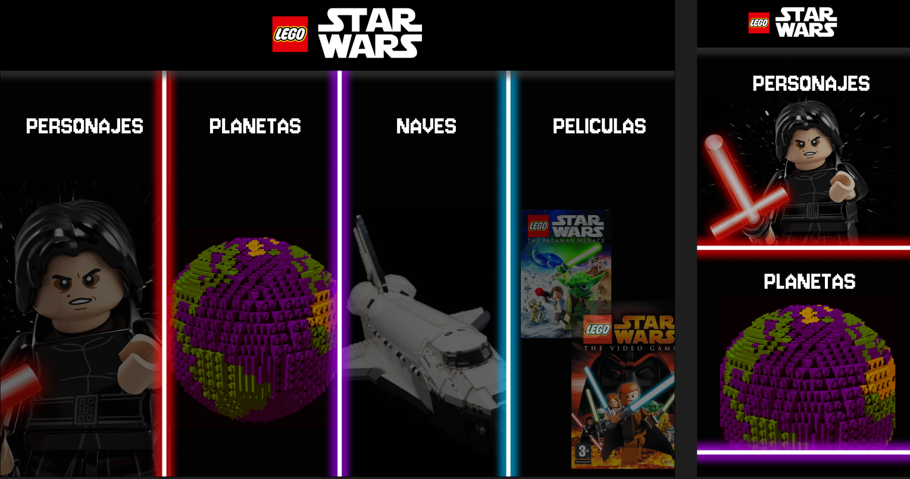
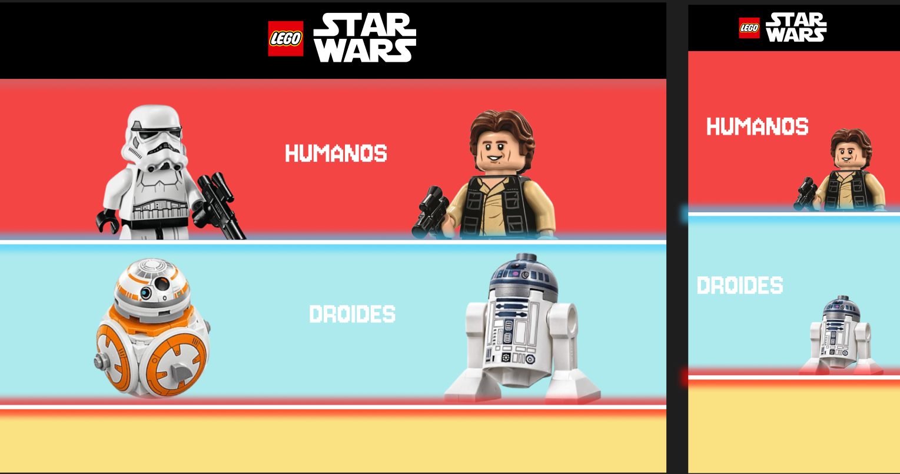
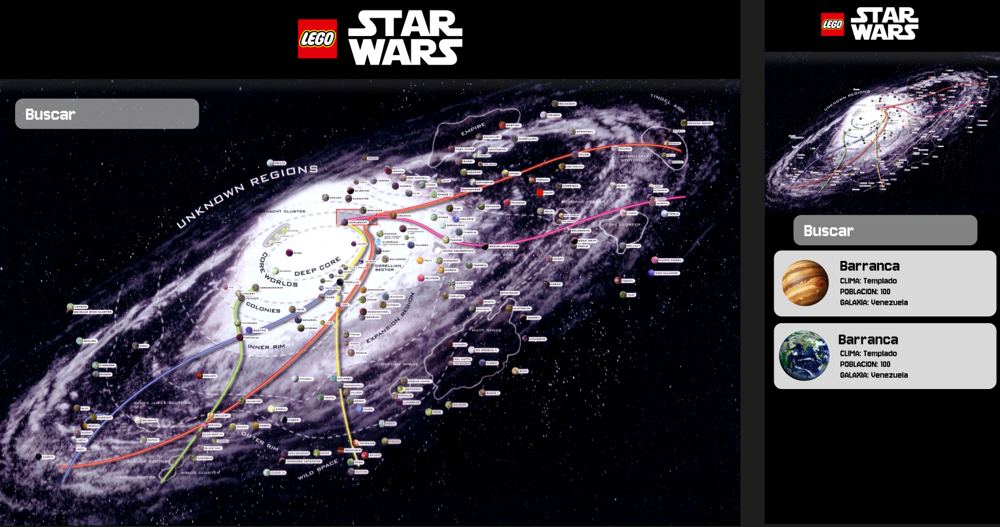
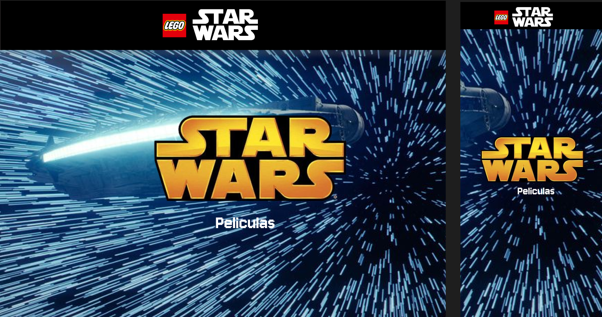
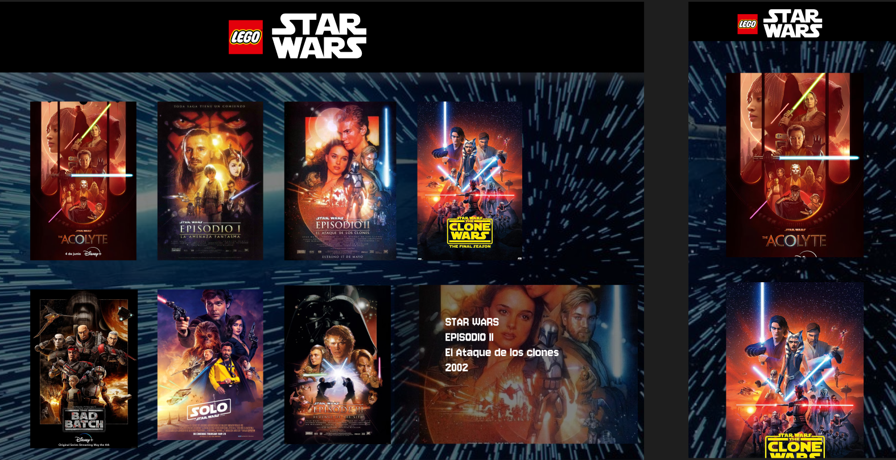
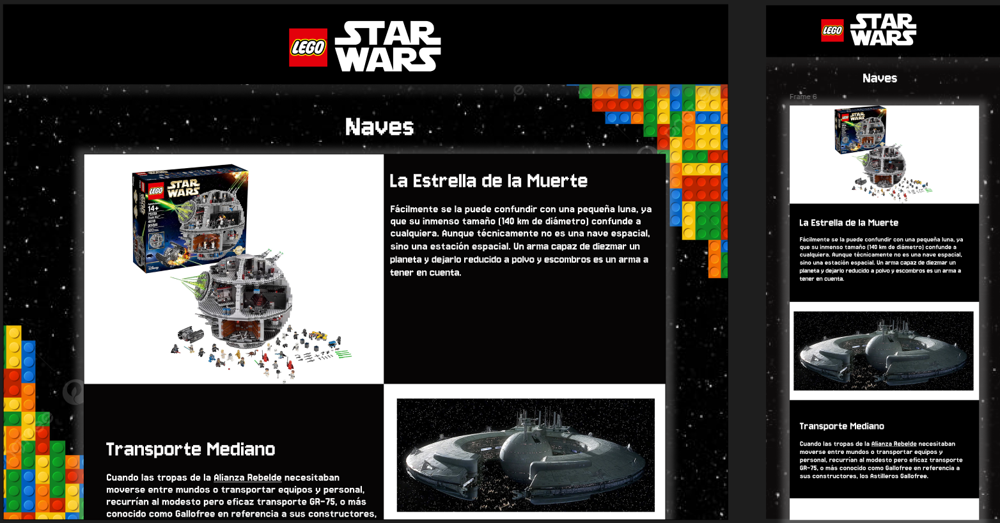

# 🌌 Star Wars Searcher

## Proyecto 2 de Aula - JavaScript  

## 📋 Descripción

Este proyecto consiste en la creación de una aplicación web tipo buscador de **Star Wars**, donde los usuarios puedan visualizar información actualizada sobre el universo de Star Wars consumiendo la API pública [SWAPI](https://swapi.dev/).

La tarea es desarrollada como parte del rol de un **Desarrollador Full-Stack**, con foco en el **Front-End**, permitiendo a los usuarios finales consultar personajes, naves, películas y demás elementos del universo Star Wars, con una experiencia visual atractiva y funcional.

---
## 📱 Responsivo

✅ Totalmente adaptado a móviles y tablets.  
☑️ Código visible y formateado correctamente en pantallas pequeñas.

---

## 🚀 Tecnologías utilizadas

- HTML5
- CSS3
- JavaScript (ES6+)
- [SWAPI](https://swapi.dev/) - The Star Wars API
- Tailwind CSS / Bootstrap *(elige uno según tu implementación)*

---

## 📚 Recursos

### API a consumir

🔗 **[SWAPI - The Star Wars API](https://swapi.dev/)**  
Una API RESTful pública con acceso a datos del universo Star Wars.

---
## 📷 Documentación - Maquetación del proyecto

### Vista Principal/Página de incio:

Esta vista busca mostrarle al usuario un menú interactivo y visual de las diferentes secciones que puede encontrar en nuestra página.  
Al pasar el mouse sobre cada sección, esta se despliega para mostrar mejor las imágenes que se contienen en ella, incentivando la exploración visual y facilitando la navegación hacia secciones como personajes, galaxias, películas y naves.



### Vista Personajes:

En esta sección, el usuario puede visualizar una galería de los personajes más icónicos del universo Star Wars.  
Cada tarjeta presenta el nombre, género, altura y peso del personaje, todo obtenido desde la API SWAPI.  
El diseño está orientado a la lectura rápida y amigable, con tarjetas responsive que se ajustan a cualquier tamaño de pantalla.




### Vista Galaxia - Planetas:

Esta vista muestra una colección de planetas del universo de Star Wars.  
Cada tarjeta incluye información relevante como el nombre del planeta, su clima, terreno y la población.  
Se diseñó con un enfoque visual claro que permite comparar planetas de manera sencilla y atractiva para el usuario.



### Vista Peliculas:

Aquí se listan las películas oficiales de Star Wars en orden cronológico de aparición.  
Cada tarjeta incluye el título de la película, fecha de estreno, número de episodio y una breve sinopsis.  
Además, se integran elementos visuales que remiten al diseño cinematográfico para dar un toque más temático.




### Vista Naves:

En esta sección, se muestra una galería de las naves espaciales más conocidas del universo.  
Cada tarjeta presenta el nombre de la nave, modelo, fabricante, capacidad y clase.  
El diseño ofrece una vista ordenada para los amantes de la tecnología y la ingeniería dentro del lore de Star Wars.



## 📦 Estructura del proyecto
```
STARWARS/
├── index.html
├── css/
│   └── styles.css
├── js/
│   └── main.js
├── assets/
│   └── imágenes, íconos, logos
└── README.md
```


## 🛠️ Instalación y ejecución

1. Clona el repositorio:
   ```bash
   git clone https://github.com/tuusuario/star-wars-searcher.git
   cd star-wars-searcher
   ```

## ✨ Autores

- [Karolain Reyes](https://github.com/KarolainReyes)
- [Andres Leal](https://github.com/Andre07g)


---

## 📜 Licencia

Este proyecto es solo con fines educativos y no tiene una licencia formal asignada. Puedes adaptarlo libremente, ¡pero por favor da crédito si lo reutilizas!

🔗 Repositorio del proyecto: [github.com/KarolainReyes/STARWARS](https://github.com/KarolainReyes/STARWARS)
